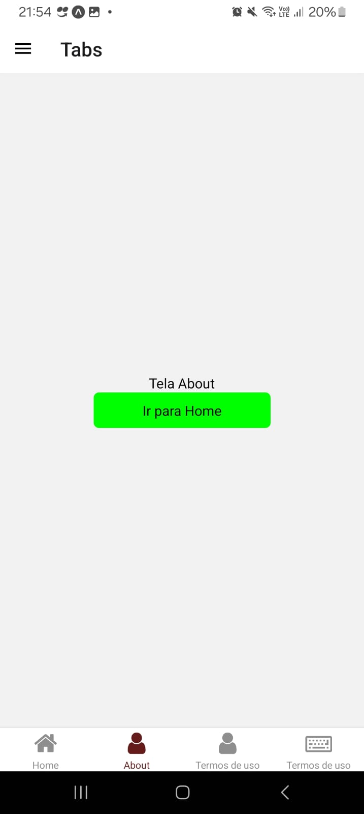

<h1 align="center"> Base App</h1>

<p>
Projeto base para startar novos projetos, contendo: 

- [ ] Splash screen
- [ ] Onboarding screen
- [ ] Login screen
- [ ] SignUp screen (com autenticação JWT)
- [ ] Profile screen
- [x] Main screen
- [x] Navigate 
- [x] Tab 
- [x] Drawer 

</p>

🚀 Desenvolvedora:
<a href="https://www.tayserosa.com">
Tayse Rosa
</a>
<br>
🟢 Status do projeto: Em andamento


<p align="center">
  
</p>


## 🚀 Tecnologias Utilizadas
<ul>
    <li>React Native</li>
    <li>Expo</li>
    <li>Typescript</li>
    <li>Splash screen  </li>
    <li>Onboarding screen  </li>
    <li>Login and SignUp auth JWT Screen</li>
    <li>Main Screen  </li>
    <li>Profile Screen  </li>
    <li>Drawer navigator </li>
    <li>Tab navigator </li>
    <li>Integração com API (Awesome API) </li>
</ul>

## 🚀 Anotações
```
npx create-expo-app --template blank-typescript
[nomeProjeto]
npx expo-doctor
rm -rf node_modules
npm i

//Drawer navigator
npx expo install @react-navigation/drawer react-native-gesture-handler react-native-reanimated

```
Fonte:
Drawer: https://docs.expo.dev/router/advanced/drawer/
Tab:    https://docs.expo.dev/router/installation/#quick-start

## 🚀 Para você rodar o projeto
```
Digite no prompt de comando: git clone https://github.com/TayseRosa/baseApp.git
cd baseApp
npm i
npx expo start
```

## Licença
Esse projeto está sob a licença MIT. Veja o arquivo [LICENSE](LICENSE.md) para mais detalhes.


## 📫 Contribuindo para Projeto

Para contribuir com Projeto, siga estas etapas:

1. Bifurque este repositório.
2. Crie um branch: `git checkout -b <nome_branch>`.
3. Faça suas alterações e confirme-as: `git commit -m '<mensagem_commit>'`
4. Envie para o branch original: `git push origin <nome_do_projeto> / <local>`
5. Crie a solicitação de pull.

Como alternativa, consulte a documentação do GitHub em [como criar uma solicitação pull](https://help.github.com/en/github/collaborating-with-issues-and-pull-requests/creating-a-pull-request).


<a href="https://www.tayserosa.com">
<p align="center">Feito com 💜 por Tayse Rosa</p>
</a>